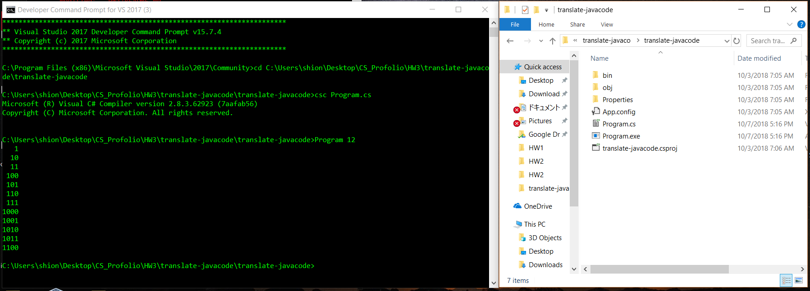

# Welcome to HW3

The third assignment for this class was to use Visual Studio to translate from Java to C#. We will eventually be using both Visual Studio and C# to code our Web Application in MVC framework, so it'll be in my best interest to get familiar with both now. 

* [View Code on GitHub](https://github.com/swakita14/swakita14.github.io/tree/master/HW3)

## Preparation:

1. First thing in this assignment was to get Visual Studio and get familiar with it. Although I've played around with it during summer, I know it's a powerful tool so I guess I'll learn more about it as I go.
2. After the environment setup was complete, I decided to look at the Java code that we needed to translate. I compiled it and ran it a couple of times to understand what it's acutally doing.
3. As seen in the HW3 assignment page, Dr.Morse advised us to translate the classes in the order of Node/QueueInterface/QueueUnderflowException/LinkedQueue/Main, So I followed and translated it in that order. 
4. Open up Visual Studio -> C# Console App -> Start Translating!

## Libraries / Conversion:

1. For this translation, it is important NOT TO COPY AND PASTE! but instead translate as you go. There are many similarities in C# and Java, but there are differences as well.
2. There are other rules in C# that are not applicable in Java:
   <ul>Built in typenames like string objects are lowercase</ul>
   
```c#
    LinkedList<string> output = generateBinaryRepresentationList(n)
```
   
   <ul>Method names and public fields start with uppercase</ul>
   
```c#
    public bool IsEmpty()
```
3. There are other differences, for intance in Java the QueueUnderflowExcpetion Class was coded like this:

```java
public class QueueUnderflowException extends RuntimeException
{
  public QueueUnderflowException()
  {
    super();
  }

  public QueueUnderflowException(String message)
  {
    super(message);
  }
}
```

But in C# the same class with the same functionality ends up looking like this:

```c#
 class QueueUnderflowException : SystemException
    {
        public QueueUnderflowException() : base()
        {
            
        }

        public QueueUnderflowException(string msg) : base(msg)
        {

        }

    }
```
4. For other things that needed translation: LinkedList, StringBuilder, and Println I looked up documentarties and libraries for both Java and C# and found the methods
   that matched each other in terms of functionality and used it.

   <ul>LinkedList.add ---> LinkedList.AddLast</ul>
   <ul>System.out.println ---> Console.Writeline</ul>


## XML Comments:

1. XML comments are a way to make your code more readable. 
2. By typing "///" on top of methods and classes, Visual Studio auto-creates a comment section that includes the parameter, return values, etc.
3. The actual comments are similar in the looks compared to HTML:

```html
 	/// <summary>
        /// This overrides the extended SystemException class's constructor using the :base() and takes a msg
        /// <paramref name="msg"/> takes in a message and overrides it through the SystemsExceptions constructor
        /// </summary>
        public QueueUnderflowException(string msg) : base(msg)
        {

        }
```


## Working Application:

1. There are different paths you can take to compile the code and get the application running, the path I took was:
	Developer Command Prompt for VS 2017 -> specify path -> compile file using csc "Program name" -> run file 

 
