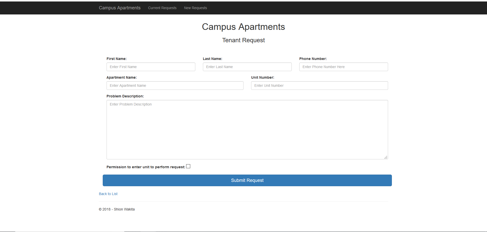

# HW5

* [Demo Video](https://www.youtube.com/watch?v=v9qrLMEKo9g&t=20s)

## Preparation

1. Similar to the previous homework, I created a MVC project and initialized all my files
2. I saw the form that he wanted us to submit and the looks of it, so I carefully planned out everything concerning the columns and the boostrap grids

## Creating a Simple One-Table LocalDB and Populating it using T-SQL

1. Great thing about Visual Studio is that when you install the data storage and procesing workload when installing VS, it gives you an option to be able to add a localdB to your project as well.
2. After adding the localdB to my project, I ran a query on it to make sure the tables were named and created. 

```sql
CREATE TABLE [dbo].[Requests] (
    [ID]            INT            IDENTITY (1, 1) NOT NULL,
    [FirstName]		NVARCHAR (MAX) NOT NULL,
    [LastName]		NVARCHAR (MAX) NOT NULL,
	[PhoneNumber]	NVARCHAR (MAX) NOT NULL,
    [ApartmentName]	NVARCHAR (MAX) NOT NULL,
    [Explanation]	NVARCHAR (MAX) NOT NULL,
	[CallMe]		BIT			   NOT NULL,
    [UnitNumber]    INT            NOT NULL,
    [SignedDate]    DATETIME       NULL,

    CONSTRAINT [PK_dbo.Request] PRIMARY KEY CLUSTERED ([ID] ASC)
	
);
```

3. I also wrote out a query that would drop the entire table and clear things out.

```sql
DROP TABLE [dbo].[Requests];

```

4. Last but not least, I created a query that would insert values into the table, which would eventually show up on the page when I call the list. 

```sql
INSERT INTO dbo.Requests(FirstName, LastName, PhoneNumber, ApartmentName, Explanation, UnitNumber, CallMe, SignedDate) VALUES
    ('Shion', 'Wakita', '961-982-9087', 'Catron Houses', 'Leaking water pipe', 408, 1, '2018-10-20 10:23:00'),
    ('Mashu', 'Wakita', '232-656-6593', 'Monmouth Townhouse', 'Heater not working', 374, 0, '2018-11-20 12:25:30'),
    ('John', 'Stephens', '408-345-1324', 'University Houses', 'Crack in the Wall', 342, 1, '2018-09-24 14:23:10'),
    ('Noah', 'Mendoza', '504-312-3453', 'Catron Houses', 'Broken refrigerator', 121, 1, '2018-07-13 10:24:00'),
    ('Mark', 'Stemple', '208-894-0928', 'Independence Housing', 'Black widow breakout',  225, 0, '2018-05-20 08:23:22')
```

## Model Class and Building a Strongly Typed View that Uses it

1. Model class in this project represents and object carrying data. Since we wanted to create stronly typed views, instead of just returning Views with no parameters, we placed and threw back the View with the model inside the parameter.
2. This is a little snippet of my model class. As you can see I have declared the label names for the model, and if they are required or not, and the validation message that follows it if not entered correctly. 

```c#
        /// <summary>
        /// Phone number of the person requesting help
        /// </summary>
        [Required(ErrorMessage = "Phone Number is Required")]
        [DisplayName("Phone Number:")]
        [RegularExpression(@"^[2-9]\d{2}-\d{3}-\d{4}$", ErrorMessage = "Please use the format: XXX-XXX-XXXX")]
        public string PhoneNumber { get; set; }

        /// <summary>
        /// user or the tenants apartment name
        /// </summary>
        [Required(ErrorMessage = "Apartment Name is Required")]
        [DisplayName("Apartment Name:")]
        public string ApartmentName { get; set; }
```

3. This is the View that utilizes the model:
```c#
        <div class="form-group col-md-4">
            @Html.LabelFor(model => model.PhoneNumber)
            @Html.TextBoxFor(model => model.PhoneNumber, "", new { @class = "form-control", @placeholder = "Enter Phone Number Here" })
            @Html.ValidationMessageFor(model => model.PhoneNumber, "", new { @class = "text-danger" })
        </div>

        <div class="form-group col-md-6">
            @Html.LabelFor(model => model.ApartmentName)
            @Html.TextBoxFor(model => model.ApartmentName, "", new { @class = "form-control", @placeholder = "Enter Apartment Name" })
            @Html.ValidationMessageFor(model => model.ApartmentName, "", new { @class = "text-danger" })
        </div>

```

## Entity Framework Context

1. In order to have the Entity Framework in your project, you first need to user NuGet to find and install the package. 
2. This context class was placed in the DAL (Data Access Layer) and it functioned as the connecting bridge between the classes in the project with the database. 
3. As you can see in the method, you place the localdB name in the parameter and connect to it with the connection string

```c#
         /// <summary>
        /// This is the context constructor that bridges the db with the application
        /// </summary>
        public RequestdbContext() : base("name=Requests")
        {

        }

         /// <summary>
        /// Tells you what you can do with the db whether to get information from it or set information in it. 
        /// </summary>
        public virtual DbSet<Request> Requests { get; set; }
```
4. If you go to the database and click property it should give you the connection string and you just copy and paste it in the Web.config file to tie the database to the project 

```html
<!--This connects the database with the application-->
  <connectionStrings>
    <add name="Requests"
   connectionString="Data Source=(LocalDB)\MSSQLLocalDB;AttachDbFilename=C:\Users\swaki\OneDrive\Desktop\SeniorYear\CS460\HW5\Campus-Applications\Campus-Applications\App_Data\Requests.mdf;Integrated Security=True"
   providerName="System.Data.SqlClient"
/>
  </connectionStrings>

```


## Designing the View

1. For this I struggled a bit due to the fact that the text areas for the views were not adjusting the way I wanted it to. 
2. The solution I found was to first open the Inspector on my web browser, and check the element, add the css ```max-width``` element to it and then change the column for the div element class. 

```css
textarea {
   
   max-width: 1170px;
}

```




