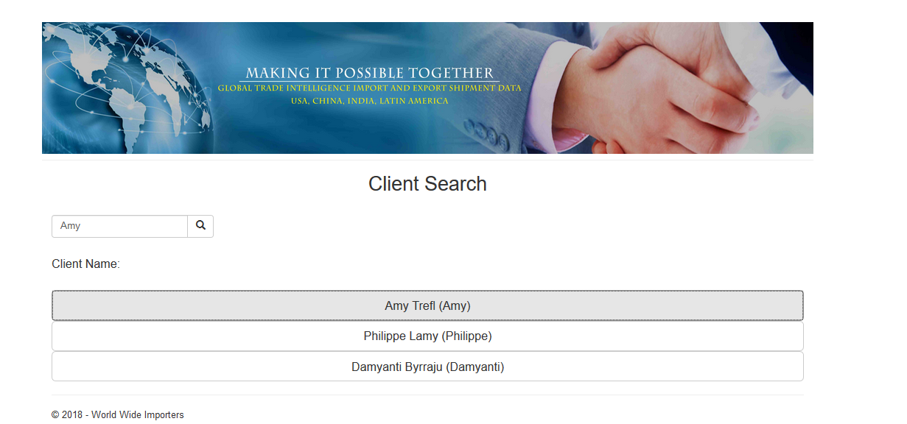
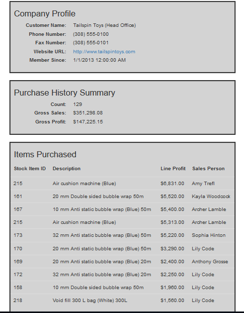
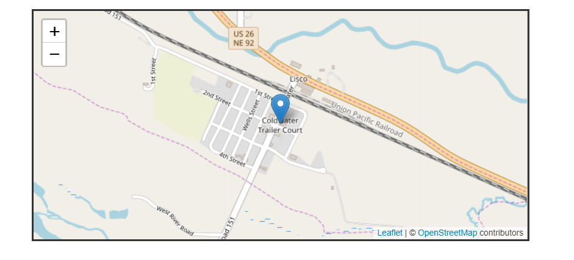

# HW6

* [Demo Video](https://youtu.be/i8jkJDDin_c)

## Preparation 

1. This week, since we were going to be working on an existing database, I downloaded and installed SQL Sever Manager to restore the .bak database file.
2. After I restored the database and connected to it, I added the ADO data modeler to my Visual Studio project and added all the models necessary for it.


## Feature #1 People Search

1. Our goal in this first feature was to create a search function and make it look through the db and returning it the person, and its information. 
2. To get a good grip on the code itself and the searching function, I created a scaffold controller using the dbContext and the Person class.
3. I went to my View, and using the Person model, I created a simple search bar that would look through all the person in my db and output the results like a button to click on 

```html
@using (Html.BeginForm("Index", "People", FormMethod.Get, new { @class = "form-inline" }))
    {<br />

        <div class="form-group">
            <div class="input-group">

                @Html.TextBox("search", "", new { @class = "form-control", @placeholder = "Enter Client Name", required = "required" })
                <span class="input-group-btn">
                    <button class="btn btn-default " type="submit"><span class="glyphicon glyphicon-search"></span></button>
                </span>

            </div>
        </div>
    }
```

4. Then I went to my Controller, and added some methods that would get the ```queryString``` from the input form and use that to look through the db.

```c#
search = Request.QueryString["search"];
if (search == null || search == "")
    {
        ViewBag.show = false;
        return View();
    }
    else
    {
        ViewBag.show = true;
        return View(db.People.Where(p => p.FullName.Contains(search)).ToList());
    }

```

5. From part of the scaffold code from the Details Action method, I was able to gain the basic concept and information on how the code worked, and of course I rewrote the details because who likes the scaffold code look?

```c#
//find the person
vm.Person = db.People.Find(id);

```

6. I also added a photo place holder for the person as well.


## Feature #2 Customer Sales Dashboard

1. This part was a extended add-on to the Feature #1. So the stakeholders could find out if the person is a customer, then show some details about their company and the World Wide Importer's sales to it. 

2. So I wrote a LINQ query that would find out if the person that is searched for is the primary contact person (that their PrimaryContactPersonID in Customer is the ID)

```c#
int cid = vm.Person.Customers2.FirstOrDefault().CustomerID;
vm.Customer = db.Customers.Find(cid);

```

3. If that person was, I assigned my ViewModel Customer a Customer from the dbContext with that ID.
4. Then I was able to access the Customer objects information from there. 

```html
<dt>
    @Html.Label("customer-name", "Customer Name:")
</dt>

<dd>
    @Html.DisplayFor(model => model.Customer.CustomerName)
</dd>

<dt>
    @Html.Label("phone-number", "Phone Number:")
</dt>

<dd>
    @Html.DisplayFor(model => model.Customer.PhoneNumber)
</dd>


```

5. Finally for the Purchases, I used to ViewBags that I assigned values for using a LINQ statement. This showed the count of the order and the total gross sales and profit that they have made from this customer.

```c#
//find the gross sales
ViewBag.GrossSales = vm.Customer.Orders.SelectMany(il => il.Invoices).SelectMany(ils => ils.InvoiceLines).Sum(i => i.ExtendedPrice);

//find the gross profit
ViewBag.GrossProfit = vm.Customer.Orders.SelectMany(il => il.Invoices).SelectMany(ils => ils.InvoiceLines).Sum(i => i.LineProfit);
```


```html
<dt>
    @Html.Label("gross-sales", "Gross Sales:")
</dt>

<dd>
    @String.Format("{0:C}", ViewBag.GrossSales)
</dd>

<dt>
    @Html.Label("gross-profit", "Gross Profit:")
</dt>

<dd>
    @String.Format("{0:C}", ViewBag.GrossProfit)
</dd>

```

6. Finally I added the top 10 most profitable items the customer has purchased 

```html
<td>
    @Html.DisplayFor(item => items.StockItemID)
</td>

<td>
    @Html.DisplayFor(item => items.Description)
</td>

<td>
    @String.Format("{0:C}", items.LineProfit)
</td>

<td>
    @Html.DisplayFor(item => items.Invoice.Person4.FullName)
</td>

## Extra Credit

1.So for extra credit, we had to add the map of the person by mapping from Customer => DeliveryAddress and get its lattitude and longitude of the DbGeography.

2.I used the LeafLet api to create the map by adding the style sheet first and the actual code for making the map

```html
<head>
    <link rel="stylesheet" href="https://unpkg.com/leaflet@1.3.4/dist/leaflet.css"
          integrity="sha512-puBpdR0798OZvTTbP4A8Ix/l+A4dHDD0DGqYW6RQ+9jxkRFclaxxQb/SJAWZfWAkuyeQUytO7+7N4QKrDh+drA=="
          crossorigin="" />
    <!-- Leaflet's JS for use with MapBox -->
    <script src="https://unpkg.com/leaflet@1.3.4/dist/leaflet.js"
            integrity="sha512-nMMmRyTVoLYqjP9hrbed9S+FzjZHW5gY1TWCHA5ckwXZBadntCNs8kEqAWdrb9O7rxbCaA4lKTIWjDXZxflOcA=="
            crossorigin=""></script>
</head>

```
```js
<script>
    var long = @Model.Customer.DeliveryLocation.Longitude;
    var lat = @Model.Customer.DeliveryLocation.Latitude;

    var map = L.map('map').setView([lat, long], 15);

    L.tileLayer('https://{s}.tile.openstreetmap.org/{z}/{x}/{y}.png', {
        attribution: '&copy; <a href="https://www.openstreetmap.org/copyright">OpenStreetMap</a> contributors'
        }).addTo(map);

    L.marker([lat, long]).addTo(map)
        .bindPopup('<p>' + @Model.Customer.City.CityName + '</p>').openPopup();

</script>

```

## Working Page








