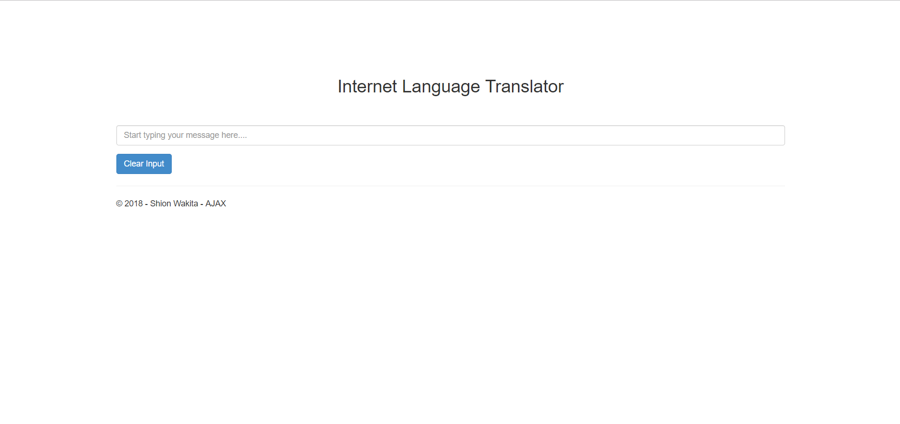
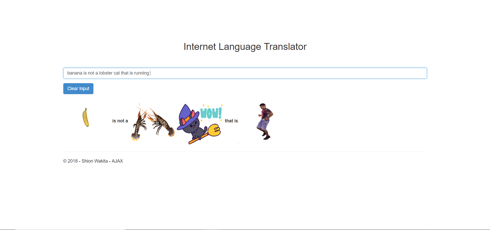

# HW7

* [Demo Video](https://www.youtube.com/watch?v=gTv8FzgwHOo)

## Planning / Setup

1. First things first, we signed up for an API key at Giphy in order to access their data. 
2. As we have the API key in our hands, it is important to hide the API key instead of pasting it directly in either our js or controller. 

```c#
 //You are not getting my ApiKey
string apiKey = System.Web.Configuration.WebConfigurationManager.AppSettings["APIKEY"];

```

3. The reason why we use the controller instead of just the js file and the View is because the js file gets sent to the page and is visible to the users, and we don't want the users seeing everything happening and how its happening. 
4. The next step is to connect the custom js file that we are using and the View with a razor with an ```@section``` tag and adding the path to our js file

```html
@*Adding my own js file to the View*@
@section JavaScript
{    
    <script type="text/javascript" src="@Url.Content("/Scripts/ajax-giphy.js")"></script>
}

```

```c#
@RenderSection("Javascript", required: false)

```

5. Once we got that working and communicating with one another, its time to work with the request sending and parsing through the data that we receive from Giphy.


## Action 

1. First I grabbed the user input string, and sent it to the controller, and the controller returns the JSON data and we use Javascript to parse through the data and grab the specific url that we want to use to output to our page. 

Create url to send:

```js
//gets the value of the user input
var txt = $('#text-input').val();
//get ths last item that is typed 
var lastitem = txt.split(" ").pop();

//routing it to my custome controller to send request 
var source = "Translate/Sticker/" + txt; //Source
```

Send the request and get JSON data back and return it to the js file:

```c#
//Creates the URL for the search function using my own API
string getURL = "https://api.giphy.com/v1/stickers/translate?api_key=" + apiKey + "&s=" + txt;

//Makes a request to the URL and receives the responce
WebRequest request = WebRequest.Create(getURL);
WebResponse getResponce = request.GetResponse();

Stream data = request.GetResponse().GetResponseStream();

//Convert the response to a string 
string convString = new StreamReader(data).ReadToEnd();

//lets parse through the JSON ojbect that we received from the endpoint
var serialize = new System.Web.Script.Serialization.JavaScriptSerializer();
var jsonObj = serialize.DeserializeObject(convString);

//Closing stream
data.Close();
getResponce.Close();

//returns JSON obj result 
return Json(jsonObj, JsonRequestBehavior.AllowGet);            

```

Parse through it and grab the specific data that we want to output 

```js
 if (notBoring(lastitem)) {
                $.ajax({
                    type: "GET",
                    dataType: "json",
                    data: { "txt": lastitem },
                    url: source,
                    success: showGifs,
                    error: errorOnAjax

                });
            }
```

## Custom Routing 

1. In our ```routes.config``` file, the specific routes are listed, and which paramter takes in what, and finally when the items are not listed in the url, which url to default to. 

2. I added my own custom routing to the file, which leads takes the searching string to the controller and the action method that creates the request and receives the response 

```c#
  routes.MapRoute(
               name: "Search",
               url: "{controller}/{action}/{search}",
               defaults: new { controller = "Translate", action = "Sticker",}
           );
        }

```


## Database Logging 

1. One of the requirements for this HW was to save the information of the user including the IP address, the browser, the time the request was sent, and the search string or the request. So I created the database, made a model file, and added the context file just like the other projects. 

Creating dB query:

```sql
CREATE TABLE [dbo].[Log_Entry] (
    [ID]            INT            IDENTITY (1, 1) NOT NULL,
    [Request]		NVARCHAR (MAX) NOT NULL,
    [IPAddress]		NVARCHAR (MAX) NOT NULL,
	[ClientBrowser]	NVARCHAR (MAX) NOT NULL,
    [AccessTime]    DATETIME       NULL,

    CONSTRAINT [PK_dbo.Log_Entry] PRIMARY KEY CLUSTERED ([ID] ASC)
	
);

```
Query to drop table:

```sql

DROP TABLE [dbo].[Log_Entry];
```

Snippet of Model file:

```c#
public string Request { get; set; }

/// <summary>
/// IP address of the user
/// </summary>
public string IPAddress { get; set; }

/// <summary>
/// browser of  client 
/// </summary>
public string ClientBrowser { get; set; }
```

Context file so that the controller can interact with the dB

```c#
public LogDbContext() : base("name=Log_Entry")
{

}

public virtual DbSet<LogEvent> Logs { get; set; }

```

2. Then I initialized the context variable and started assigning the necessary information using the ```Request``` function which is part of the controller. 

```c#
var dbContext = db.Logs.Create();

//Assigns the time to the dB
dbContext.AccessTime = DateTime.Now;

//Getting the IP of the user
dbContext.IPAddress = Request.UserHostAddress;

//What the user searched for 
dbContext.Request = txt;

//What the client browser it 
dbContext.ClientBrowser = Request.UserAgent;

//Lets save the changes 
db.Logs.Add(dbContext);
db.SaveChanges();

```

## Working Pages 



