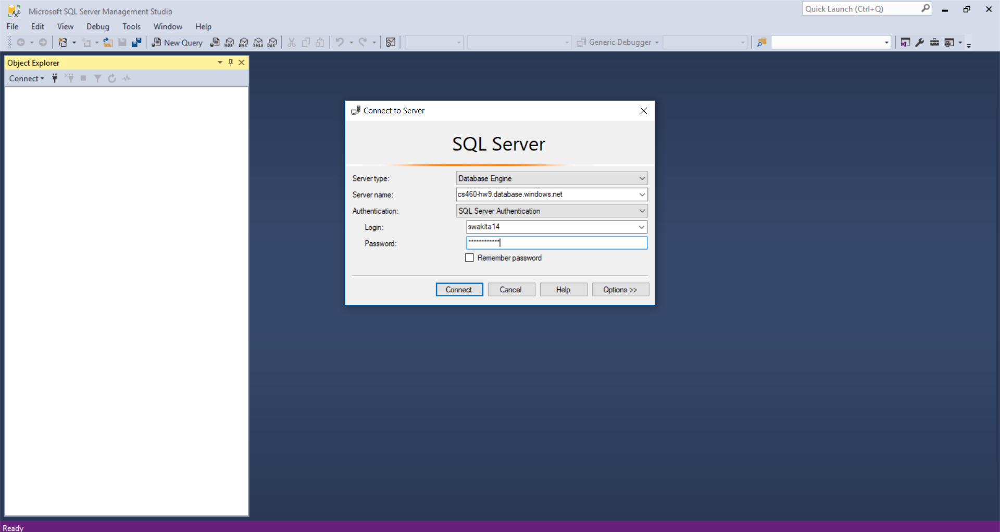

# HW9

* [Demo Video2](https://vimeo.com/user92245512/review/303391518/680b5c26e8)

## Side-Note

Its been a tough term, but all things must come to an end. I am happy that I was able to sort-of survive this term, and mostly be able to collaborate with my team (you know who you are) and finish strong together. Hopefully this profolio will be descriptive enough for me to survive and succeed in the final exam.   

## HW Overview

In this Homework, we will grab the previous HW (Multi-table MVC-Web Applcation) and deploy it to Azure. The steps that I will be taking to successfully deploy this application in the cloud is by following these steps carefully:

1. Create a Resource Group
2. Create a SQL Databse inside this Resource Group
3. Add a Firewall Rule
4. Connect to db using SSMS and run UP script
5. Get the connection string 
6. Create Web App on Azure
7. Deploy Web App to Azure and configure connection string

## Creating a Resource Group 

1. First, we want to create a resource group that all the project necessity (db, db-server, web-app) will be nested in. 

## Create a SQL Database inside this Resource Group

1. After the Resource Group is created, we want to head over to the SQL Database section and create a Database. 
2. While we're there, it is wise to simply create a new SQL database server as well. 
3. It is important to make sure we select the right resource group that we just created. 

## Add a Firewall Rule

1. Once both the database and the database server is created, we want to head over to the database server, and add a firewall rule.
2. When we get there, we would want to add the Client IP Address to the list of firewalls and virtual networks, and then SAVE the changes

## Connect to db using SSMS and run UP script

1. After the firewall rule has been added, we can finally access it. 
2. So lets make our way to the SQL Database and copy the server name. 

3. Open up SSMS and add paste the server name, and add the credentials to login to the server

4. Then you would want to right-click the database, and hit the "run query" and run the UP script for your application 

## Get the connection string 

1. We now want to go the SQL database and grab the connection string from the ADO.NET section. 

2. We then want to go to our web configuration file in VS, and insert in the connectionstring="inserthere" and make sure to add the db login information with is in the connection string 

## Create Web App on Azure and configure connection string

1. Once all the steps on the top are done, we want to create a appservice, and same as the db, and db server, we want to create it in the same resource group.

2. Then go to Application Settings and add the connection string that you copied from the database. 
3. MAKE THE CONNECTION STRING THE SAME NAME YOU GAVE IT IN THE WEB.CONFIG
4. Select SQL Server as the Type and you are almost there

## Deploy Web App to Azure 

1. We then want to go to Publish the app in VS.
2. Select the App Service, and select From Exisiting, and finally select the resource group and the app service that is already waiting for you in the Cloud. 

